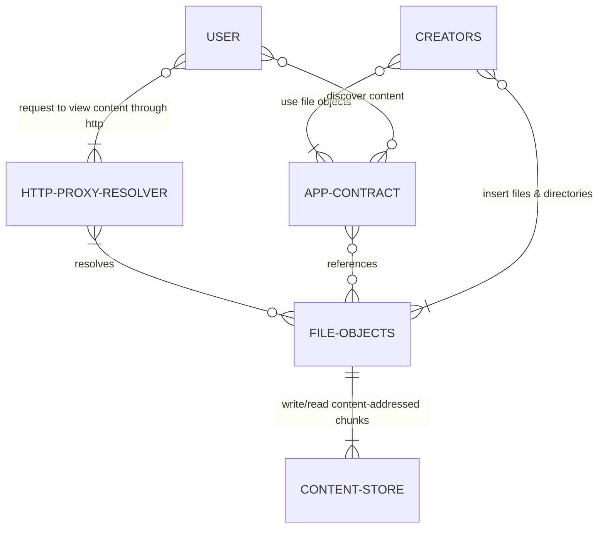

# 📂 ONCHFS (On-Chain for Http File System)

The On-Chain for Http File System (onchfs) is a permissionless unix-like content-addressable file system fully stored on-chain designed to be delivered through the http protocol, with cross-blockchain compatibility in mind.

The onchfs is inspired by [ethfs](https://github.com/holic/ethfs), [ipfs](https://ipfs.tech/), [bitcoin ordinals recursive inscriptions](https://docs.ordinals.com/inscriptions.html), [Unix file systems](https://en.wikipedia.org/wiki/Unix_filesystem), and aims at providing a general framework for working with files stored on-chain, following modern standards & practices.

# This repository

This repository holds many resources to facilitate learning about or implementing the ONCHFS. To go straight into implementing an application with the file system, check out the [onchfs js package](./packages/onchfs-js/)

```
repo
├── examples
│   ├── http-proxy — lightweight http proxy server
│   └── next-js-upload — front-end example to upload
├── packages
│   └── onchfs-js — cross-env js package go-to package
└── docs
```

# Motivations

At [fxhash](https://fxhash.xyz) we build tools for Generative Artists to release their projects on blockchains. The project was first implemented on [Tezos](https://tezos.com/), however unlike other Generative Art platforms at the time we opted for storing any content on IPFS, as we realised uploading web-based Generative Art as a string (& providing an list of dependencies) was not a great experience for artists, especially in nowadays modern web standards. As we decided to provide support for storing the code on-chain, right before releasing support for Ethereum, we investigated the current state of on-chain storage for Generative Art projects.

Most platforms on Ethereum use html reconstruction on-chain based on:

- some javascript code proper to each project, uploaded as a string (encoded and compressed in various ways)
- a list of dependencies pointing to scripts previously uploaded by a central entity, in most cases (without options to upload any library for anyone to use in a convenient way)

The actual content is stored in a [Content-Addressable Store](https://en.wikipedia.org/wiki/Content-addressable_storage), and some logic is responsible for reconstructing the chunks of content into digestable files. Some notable projects are [ethfs](https://github.com/holic/ethfs) (general-purpose Content-Addressable Store + shared name-based file system), [scripty](https://github.com/intartnft/scripty.sol) (HTML reconstruction built on top of ETHFs).

While this approach provides on-demand HTML reconstruction as long as there is access to a running node, it presents strong disadvantages for what we would consider as a

- **interferences on artistic practices**: artists have not only to think about implementing each platform API for their project to be compliant, but also they must obey to some predefined code structure as eventually their whole code is going to be one string
- **inter-operability between assets**: while file data is content-addressed, files are addressed by their name on the system; this introduces major inter-operability issues as user can never fully trust some name faily describe the data it contains
- **security, vector for dependency-injectiona (and therefore execution)**: in essence, users have to rely on central entities to provide a list of verified files, which in essence can be composed of any arbitrary data which can only be verified by querying and inspecting such file. This introduces a vector for injecting malicious code in what would seem to be a legit and trusted file (imagine embedding a wallet drainer which would trigger past a given date on a file named `processing-1.3.1.min.js`, yet exposing all the features of its valid counterpart). While this approach may work for centralized & semi-centralized platforms, if we want to build an open ecosystem where anyone can provide libraries for public access, such system cannot fully be trusted.
- **too specialised**: outside of HTML reconstruction, it becomes hard to extend current approaches for any kind of file-based application

Our approach aims at solving what we consider to be core issues, at a cost we consider to be negligable. To give a quick overview, our approach solves all the points above but requires a file resolver (which can be an http-proxy or a service worker).

# ONCHFS Concepts

## Permissionless

Anyone can write data, create files & directories, & reference files stored on the file system.

## On-chain

Every byte necessary to fully reconstruct the file system is stored on-chain. Standards provide a way to write & read the file system.

## Immutable

Content created on the file system can never be altered.

## Inter-operable

The raw bytes of data are stored as chunks in a dumb Content Store contract, only supporting low level operations such as write & read. Because the chunks of data are Content-Addressed, many applications can use the Content Store for various purposes without impacting each other. This protocol provides extra abstraction layers to improve upon just having a Content Store.

## Content-Addressable

Chunks of data are hashed and identified by their in the Content Store hash. Similarly, files & directories are Content-Addressed.

## Unix-like

An abstraction layer inspired by [inodes](https://en.wikipedia.org/wiki/Inode) on [Unix-like file systems](https://en.wikipedia.org/wiki/Unix_filesystem) provides a generic way to organise the Content Store into files & directories.

An inode can be a file or a directory:

- file: an ordered list of pointers to chunks of bytes in the stored in the Content Store, and some extra data describing the file
- directory: a list of inodes with their assigned names

inodes are also Content-Addressed, the hash of their content is used to identify the inodes on the file system. Such hashes are used as entry points to the file system, and are referred to as Content Identifiers (CID).

## Designed for the http protocol

As browsers are the main (if not the unique sensible) gateway to web3 assets, the protocol is designed to easily serve its content through the http protocol, in such a way that assets can easily reference and load other assets stored in the file system, using the native behaviour of modern browsers through the http protocol.

While the http protocol isn’t directly built into the Smart Contracts (yet), the protocol specifies particular guidelines so that consumers of the system provide particular metadata for delivering resources through the http protocol, in an optimised fashion.

However the protocol specifies how proxy servers should be implemented to navigate the file system using the URIs native to the file system.

## Extensible

As the protocol provides very low level primitives, it’s easy to extend it by providing other abstraction layers for navigating the file system.

For instance, we could imagine an “http-like” contract which would take “http-like” requests to return content stored in the file system with http-compliant response messages.

# Overview

The following diagram describes how the various system components interact together (we also added the users to visualise the entry points of the system):



## Content-Store

The Content Store is a standalone Smart Contract which supports the following operations:

- write(bytes) → pointer
- read(pointer) → bytes

The Store keeps a table of the chunks written, referenced by their hash.

For instance, let’s imagine one wants to write the following content:

```
80 76 05 fb 1d 7f 57 e3 14 71 8a 28 af 5a 80 ea
f6 04 b1 81 4d aa 2a 48 92 51 03 bd 33 23 60 47
96 5d 11 0d c4 22 56 19 af d8 14 c7 51 0a 60 b2
57 2a 72 aa 98 e8 e5 3d 30 05 80 3a 0d f4 5f 28
ae 16 75 84 cf 28 aa 11 4e 3d a6 e3 5e 30 9e ce
7d e0 f4 d6 f6 de 38 43 63 83 2d 9a c4 a9 aa 60
6f 00 89 f2 01 c4 81 0a 89 85 d0 d2 d2 5f c4 06
8f c6 26 e2 a0 c8 40 d8 3e 23 c2 06 02 11 67 c2
32 38 eb 92 54 1b 87 3d ba ef 97 5c 34 39 6d 4c
```

The write operation will hash these bytes using keccak256, producing a 32 bytes unique signature (ex `1ed06317e8b25582933a1146b5629e8b89306df355283c95d78b9d109913ee60`) associated with the content. The content is then stored in a lookup table:

```
| pointer      | content                |
|--------------|------------------------|
| 1ed06...ee60 | 807605fb...            |
| cedf6...7674 | 34e705eb...            |
| ...          | ...                    |
```

```
TODO
provide contract interfaces
```

# File Objects

A File Objects contract provides higher-level instructions over the Content-Store to describe and organise files. Inspired by Unix systems, it keeps a table of inodes. An inode can be either a **file** or a **directory**, referenced by their 32 bytes hash in the lookup table. The File Object contract supports the following operations:

```
todo
add contract interface
```

## File inode

An inode file will store:

- a list of Content-Store pointers, whose concatenated content form the file data
- some file metadata (data about the file’s data, such as encoding and content-type) **designed to serve the file over http**

This is an example of an inode file:

```
file
- chunk_pointers: [ 1ed06...ee60, cedf6...7674 ],
- metadata: [ 00d456da..., 01879dca... ]
```

Files **don’t have a name**, instead directories can create named pointers to files. A same file can have different names in different directories.

Files **must reference** existing chunks in the Content Store. When creating a file, a list of Content Store pointers is provided, and the File Objects contract fails if it cannot read the data under a given chunk.

### File CID

The inode CID of a file is computed by hashing the inode in such a way:

```
let fdata be the concatenation of the chunks referenced by their pointers
let mdata be the concatenation of all the metadata fields

cid = keccak(
	concat(
		bytes(0x01),      # identifying byte to avoid collisions with directories
		keccak( fdata ),  # hash the file data
		keccak( mdata ),  # hash the metadata
	)
)
```

As a consequence, a same file data with the same metadata will always have the same CID, however a same file data with different metadata will have a different CID. As such, a file CID points to a unique file (data, metadata) combination. The metadata of a file is immutable, to _update_ a file metadata another file must be created.

### File metadata

The file metadata is designed to facilitate the delivery of the file content through the http protocol. The metadata is a list of bytes, each item in the list being a field of the metadata. The first 2 bytes of each item are used to encode the type of the field, while following bytes contain the value of the field, encoded in 7-bit ASCII.

This is the list of the supported metadata fields, referenced by their identifying prefix bytes:

- `0x0000`: [Content-Type](https://developer.mozilla.org/en-US/docs/Web/HTTP/Headers/Content-Type)
- `0x0001`: [Content-Encoding](https://www.notion.so/onchfs-d55a59ae7b334502a3a8c6afd3360291?pvs=21)

For now, these are the only supported metadata fields. These fields will be used for delivering the file data with the right http headers in the responses.

## Directory inode

An inode directory will store a list of (name → inode CID). A name in a inode directory must be unique. Different names can point to the same inode CID, as many paths can point to a given resource. Referenced inodes can either be directories (for nested structures) or files (leaves of a file tree).

```
directory example
{
	"index.html": 0x56da...87f5, // inode file
	"main.js": 0xd2e8...b1ed,    // inode file
	"includes": 0x63c3...f65a,   // inode directory
}
```

- Names **must be at least 1 character long**.
- Names **in a directory must be unique**.
- Names **are alphabetically ordered**.
- Names are strictly restricted to the 7-bit printable ASCII (US ASCII) character set. Unicode characters can be encoded in UTF-8 using a percent-based encoding as defined in RFC 3986. While the protocol will only accept characters in the 7-bit ASCII range, proxies & front-end application can decode URIs into Unicode using ASCII for human readability. Dynamic content such as html can also use UTF-8 characters to reference other resources in the file system, as browsers will naturally encode such paths when querying the server.
- The **following characters are reserved and cannot be used as part of the name**: `:/?#[]@!$&'()*+,;=`, as these are part of the [reserved character set for constructing URIs in RFC 3986](https://datatracker.ietf.org/doc/html/rfc3986#section-2.2). As file system paths will be used to uniquely identify and read resources from the file system using the http protocol, the paths in the file system cannot collide with the URIs.

### Directory CID

The inode CID of a directory is computed by hashing the inode in such a way:

```
hash_chunks = []
for (name, cid) in directory_entries   # entries are alphabetically ordered
	hash_chunks = [
    cid,             # fixed-length 32 bytes inode CID
    keccak( name ),  # hash the file name
    ...hash_chunks
  ]
cid = keccak(
  concat(
    bytes(0x00), # identifying byte to avoid collisions with files
    hash_chunks
  )
)
```

This hashing strategy ensures that a slight change in a directory (file name, cid pointer) will yield a different CID. Moreover, there cannot be collisions with this design as long as keccak cannot be exploited.

# Resources URIs

URIs are sequences of characters identifying resources in the protocol. onchfs URIs follow the [RFC 3986](https://datatracker.ietf.org/doc/html/rfc3986) standard for URIs.

More specifically, onchfs URIs align with the [RFC 1736](https://datatracker.ietf.org/doc/html/rfc1738) standard for URLs, so that browsers can naturally interact with resources on the ONCHFS through a proxy as if they were interacting with a regular http server.

Simply put, URIs are constructed as following:

```
onchfs://[<authority> /]<cid>[<path>][? <query>][# <fragment>]
```

The ABNF specification for onchfs URIs, as defined in [RFC 5234](https://datatracker.ietf.org/doc/html/rfc5234)

```abnf
URI                   = "onchfs://" [ authority "/" ] cid [ "/" path ]
                        [ "?" query ] [ "#" fragment ]

; while the authority is blockchain-specific as different
; blockchains will have different strategies to identify
; its resources with URI, this provides a generic pattern
; for the authority as reference:

generic-authority     = [ contract-address "." ] blockchain-name
                        [ ":" chainid ]

; this defines how the authority is constructed for the
; ethereum and tezos blockchains, currently supported

authority             = authority-tez / authority-eth

authority-tez         = [ tez-contract-addr "." ]
                        ( "tezos" / "tez" / "xtz" )
                        [ ":" ( "mainnet" / "ghostnet" ) ]

authority-eth         = [ eth-contract-addr "." ]
                        ( "ethereum" / "eth" )
                        [ ":" eth-chainid ]

eth-chainid           = 1*DIGIT
                          ; ex: 1=mainnet, 5=goerli, 6=arbitrum

; a cid is always 64 hex characters (32 bytes), and no authority
; construction can collide with it. that's how it gets
; differenciated from it by parsers
cid                   = 64hex

; path aligned on RFC 1738 section 5
path                  = segment *[ "/" segment ]
segment               = *[ uchar / low-reserved ]

query                 = *[ uchar / low-reserved / "/" / "?" ]

fragment              = *[ uchar / low-reserved / "/" / "?" ]

; blockchain-specific utilities
tez-contract-addr     = "KT" ("1" / "2" / "3" / "4") 33( b58 )
eth-contract-addr     = 40hex

; base58 check encoding characters
b58                   = "1" / "2" / "3" / "4" / "5" / "6" / "7" /
                        "8" / "9" / "A" / "B" / "C" / "D" / "E" /
                        "F" / "G" / "H" / "J" / "K" / "L" / "M" /
                        "N" / "P" / "Q" / "R" / "S" / "T" / "U" /
                        "V" / "W" / "X" / "Y" / "Z" / "a" / "b" /
                        "c" / "d" / "e" / "f" / "g" / "h" / "i" /
                        "j" / "k" / "m" / "n" / "o" / "p" / "q" /
                        "r" / "s" / "t" / "u" / "v" / "w" / "x" /
                        "y" / "z"

hex                   = DIGIT / "A" / "B" / "C" / "D" / "E" / "F"
                              / "a" / "b" / "c" / "d" / "e" / "f"

pct-encoded           = "%" hex hex

safe                  = "$" / "-" / "_" / "." / "+"

extra                 = "!" / "*" / "'" / "(" / ")" / "," / "~"

low-reserved          = ";" / ":" / "@" / "&" / "="

reserved              = low-reserved / "/" / "?" / "#"

unreserved            = ALPHA / DIGIT / safe / extra

uchar                 = unreserved / pct-encoded

```

## Outside the protocol

Resources loaded outside of the onchfs protocol should always specify the schema name (`onchfs://`) at the beginning of the URI, as to specifically identify the target as part of the file system.

## Inside the protocol

Resources inside the file system, such as html files, **must omit the schema** when they reference/load other resources, as it’s implied in the context. Moreover, this mechanism ensures native browser features can resolve URLs naturally.

Dynamic resources can load other resources using relative or absolute paths.

## Relative/Absolute paths

If a resource is stored at `/3da4...6d76/some-folder/index.html`, then it can use relative or absolute paths to point to other resources in the file system. For instance:

```html
# Will point to /3da4...6d76/some-folder/script.js
<script src="./script.js"></script>
# Will point to /6b87...7823/processing.min.js
<script src="/6b87...7823/processing.min.js"></script>
# /53ad...def4 can be a file, in which case it can be imported
<script src="/53ad...def4"></script>
```

## Resource resolution

Resources are resolved from the URI simply by using the `<cid>/<path>`. The `cid` is used to find the root inode, from which the `path` can be resolved by navigating the tree of inodes. The resource can either be a `directory` (in which can it can only be served through http if it has an `index.html` file at its root) or a `file` (in which case its metadata is used to serve it over http).

Smart contracts provide a generic `get_inode_at(cid, paths[])` view which can resolve an inode from its full path in a single call.

## Examples

```
onchfs://6db0ff44176c6f1e9f471dc0c3f15194827d1129af94628a3a753c747f726840
```

Point file object at `6db0ff44176c6f1e9f471dc0c3f15194827d1129af94628a3a753c747f726840` , where the context in which the URI was found defines the blockchain/network (for instance if a smart contract references this address, the resources will be found on the main file object smart contract of the ethereum mainnet)

---

```
onchfs://6db0ff44176c6f1e9f471dc0c3f15194827d1129af94628a3a753c747f726840/folder/index.html
```

Point inode folder at `6db0...6840` , in its `folder` directory, in which `index.html` is the target. Context is defined by where URI is found.

---

```
onchfs://ethereum:5/6db0ff44176c6f1e9f471dc0c3f15194827d1129af94628a3a753c747f726840
```

Point file object at `6db0...6840` on the `ethereum` blockchain, goerli (`:5`) chain

---

```
onchfs://68b75b4e8439a7099e53045bea850b3266e95906.eth/6db0ff44176c6f1e9f471dc0c3f15194827d1129af94628a3a753c747f726840
```

Point file object `6db0...6840` on the contract `68b75b4e8439a7099e53045bea850b3266e95906` of the ethereum mainnet

# Serving the file system

Modern browsers can be used to navigate the file system, creating a bridge between the content loaded in-browser & a proxy server.

## Serving resources through the http protocol using proxy servers

A proxy server only needs access to a node client of the blockchain on which it delivers the content from.

The proxy server will receive URIs to resources stored on the file system, and will resolve such URIs following the the [Resource resolution strategy](#resource-resolution) defined previously.

The server must listen to get requests at its root, so that absolute paths specified by dynamic content will be resolved by browsers using the root of the URL as a base.

Different strategies can be used to fetch the resources from the File Objects smart contract:

- by using the raw entry points exposed by the Smart Contract
  - `get_inode_at(cid, path[])` (recommended) to directly fetch the inode
  - `read` to traverse the tree of files, followed by `read_file` to get the content
- by indexing the smart contracts and providing fast-resolution from a fast-access data storage solution

Files are composed of 2 distinct parts:

- metadata
- data

The metadata is specified such as http headers can be formed directly from it, as defined in the [File metadata](#file-metadata) section.

The raw bytes can be served in the body of the http response, they will be interpreted properly by the browsers as long as the metadata was defined properly.

## Sandboxing

Resources inside the onchfs can only reference other resources inside the onchfs. They cannot reference (nor load) resources outside of it. This is accomplished by loading dynamic resources (such as html, svg, …) inside `iframes` with the `sandbox` attribute, as well as serving resources with `Content-Security-Policy` headers to restrict the network calls they can make.

# Uploading files & directories to the system

## Files

A file must be uploaded by first dividing it into chunks of predefined size, and by write each chunk to the Content Store using the `write` function. Then a file is created in the File Object contract using the `create_file` function, by specifying ordered pointers to its chunks, & some formatted metadata.

## Fully crafted operations at once

Due to the nature of the file system, and the predictability nature of the pointers generated to reference files & directories, it is possible to fully compute the operations before sending any. This also allows gas estimations to be precomputed for the full insertion of a directory.

## Optimisations

### Deeply nested structures

It should be noted that deeply nested directory structures will result in the creation of many inodes (one for each file, one for each directory), which may result in extra writing costs (as one inode requires at least 32 bytes of storage if it’s written for the first time).

Flattening the directory is a potential solution for optimising for reducing the write costs, if possible. However, no upload solution can automate such a flattening, at best it can detect a potential optimisation in that regard.

Example:

```
Non-flattened, will produce 9 inodes (5 files, 4 directories), which is at least
32x9 bytes, plus the name of the directories (14 bytes in this case)

index.html
style.css
libs
└── utils
    ├── colors.js
    ├── files.js
    └── fetch
        └── fetch.js

Using a flattened file structure, only 6 inodes will be produce (5 files,
1 directory), which reduces the total write of 32x4 bytes

index.html
style.css
lib-colors.js
lib-files.js
lib-fetch.js
```

### Long file names

As file names are stored On-Chain, longer file names will result in more bytes written. While this is rather insignificant compared to writing file data, it could in some instances be notable.

### Compressing file data

It is recommended to use compression algorithms (such as gzip or brotli) for compressing file data, ensuring a smaller footprint for a same result. As the protocol specifies a metadata field for Content-Encoding, and as modern browser will natively decompress the data, this won’t have any impact on the final user experience.

# Best-in-class for Generative Art

We wanted to give a few words about the many benefits of such a system for modern Generative Art on the web.

## No interference with workflows

Because whole directories can be uploaded at once, it is very easy for artists to structure and upload their project as they see fit, without any alteration made by the platform to the final code.

```
index.html
main.js
lib
├── math.js
└── vector.js
shaders
├── frag.glsl
└── vert.glsl
style.css
```

_This directory can be uploaded as-is to the file system, which will serve it like any static http server_.

## Best long-term support for libraries

Instead of referencing a list of libraries when uploading and having to maintain such libraries locally for development purposes, this solution provides an direct and optimised translation of a project from dev to publication.

Let's take the following example:

```
project
├── index.html
└── processing.min.js — version 1.7.0
```

When working with projects locally on your machine, you can download libraries, put them next to your scripts, and import them in the HTML as you would normally do. The project can be executed locally without any problem as all the files are available.

Then the magic kicks in; the project can be uploaded directly to the onchfs, and if the library has already been published by anyone (let it be a central authority or another artist), then during the upload the system will compute its onchfs CID locally, and if it matches an existing file on the onchfs it will not upload it; it will be automatically reference the exising one.

```
upload process

- index.html: 84726bbc90... <- new content, needs to be uploaded
- processing.min.js: 588d765249... <- already exists, can just be referenced
```

There is a complete separation of concerns between how files are structured and uploaded, and how they are stored and retrieved in an optimal way by the system.

Moreover, if as an artist you are often reusing and importing a custom (or not widely-used) library, you can simply import it as you used to and the system will always simply reference it in the future.

## Cross-chain compatibility

Because everything is content-addressed, as long as a set of contracts (Content-Store & File Objects) implements the same specifications, a same content will have the same CID on any blockchain.

Moreover, because the system provides a generic way to fetch and explore assets, and provides blockchain references in its URI specification, in theory any asset can reference any other existing asset on any support blockchain.

While in practice the use-cases are limited, it's interesting to note this inter-operability, as it may be relevant to some use-cases. For instance at fxhash, as we support this spec both on tez and eth, we can easily reference commonly-used libraries under the same CID, which facilitate various kind of integrations.

# Known limitations

## Availability of the content

Current html-on-demand solutions have the benefit to allow instant-availability of the assets as long as users have access to:

- an available blockchain node (most often accessed via explorers such as tzkt or etherscan)
- a browser which can run the code

Our approach requires an extra component:

- an available blockchain node
- a proxy-http resolver
- a browser which can run the code

Due to the nature of the system, **anyone** can run their own resolver, let it be locally or by exposing it publicly. It's a very cheap software to run.

## Ecosystem support

In its current state, and due to its recent age, the ONCHFS is not supported by 3rd party marketplace (OpenSea on ETH, objkt.com on TEZ, etc...) natively, as in if they find a `onchfs://` uri in some token metadata, they won't know how to diplay it (because they will not have an implementation of the http proxy available).

As such, it is recommend to use a changeable `baseUri` for referencing onchfs assets at the time being, which will take the value of a known reliable onchfs http-proxy server. When the ecosystem will start adopting the standard, such `baseUri` can be swapped to onchfs and locked to provide long-term reliability of the assets.

```
onchfsCid = f5f235865eaa3d1d...
baseUri = https://some-proxy.com/
tokenUri = {baseUri}{onchfsCid}

# at first
tokenUri = https://some-proxy.com/f5f235865eaa3d1d...

# then
baseUri = onchfs://
tokenUri = onchfs://f5f235865eaa3d1d...

```

# References

- [RFC 3986 / Uniform Resource Identifier (URI): Generic Syntax](https://datatracker.ietf.org/doc/html/rfc3986)
- [RFC 1738 / Uniform Resource Locators (URL)](https://datatracker.ietf.org/doc/html/rfc1738)
- [RFC 5234 / Augmented BNF for Syntax Specifications: ABNF](https://datatracker.ietf.org/doc/html/rfc5234)
- [RFC 2718 / Guidelines for new URL Schemes](https://datatracker.ietf.org/doc/html/rfc2718)
- [RFC 3628 / UTF-8](https://datatracker.ietf.org/doc/html/rfc3629#ref-UNICODE)
- [IPFS - Content Addressed, Versioned, P2P File System](https://github.com/ipfs/papers/raw/master/ipfs-cap2pfs/ipfs-p2p-file-syste.pdf)
