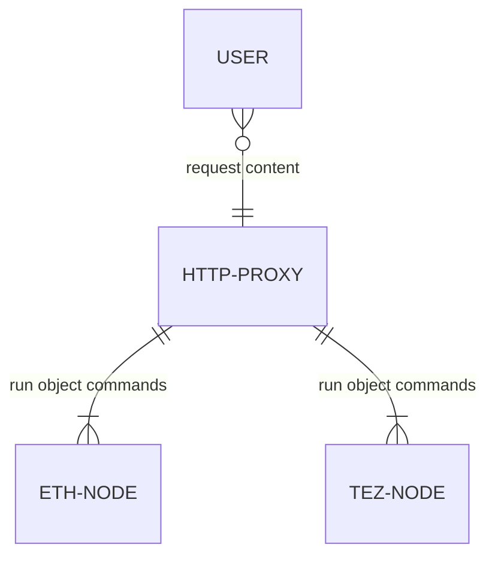

# HTTP Proxy

onchfs was designed to be easily served through the HTTP protocol, as such the system is specified with a proxy http server, for which utilities are implemented to faciliate its implementation.

:::info not required to use onchfs
It should be known that implementing a proxy, while rather straightforward, isn't mandatory to work with onchfs. This page explains how proxies can (and should) resolve onchfs resources, but eventually existing proxies can be used for most applications.
:::

## Overview

In essence, the proxy acts as a middleman between users who are requesting content and blockchain nodes from which on-chain content can directly be retrieved. The proxy implements a set of specifications allowing content on the onchfs protocol to be explored using web browsers, which we've identified as the primarly (if not the only) sensible customer usage of the system.



## Proxy configuration

The proxy needs access to a node (or indexer) of a blockchain for which it wants to support serving data from. For multi-chain proxies, a list of blockchain "providers" needs to be configured upfront, giving the proxy the ability to query blockchain data when requested.

This is an example of a setup using the [onchfs js library](/docs/libraries/onchfs-js/overview):

```js
const resolver = onchfs.resolver.create([
  {
    blockchain: "tezos:mainnet",
    rpcs: ["https://rpc1.fxhash.xyz", "..."],
  },
  {
    blockchain: "tezos:ghostnet",
    rpcs: ["https://rpc1.fxhash-dev.xyz", "..."],
    // optional, the blockchain default one will be used by default
    contract: "KT1dEp...",
  },
  {
    blockchain: "ethereum:mainnet",
    rpcs: ["https://rpc-eth.fxhash.xyz", "..."],
    // optional, the blockchain default one will be used by default
    contract: "a1e2a3e4...",
  },
])
```

Then, the proxy will listen on any GET request and will follow a resolution pattern described below.

## Requesting content on the proxy

Typically, URIs to onchfs resources will be found in their absolute form, on some blockchain contract (ex: `onchfs://a0b1c2d3...`). The URI specification was designed such that its schema-specific-part can be passed directly after the authority component of the proxy URL. To illustrate this concept, consider the following diagram:

```
onchfs://<schema-specific-part>
         ───────────┬──────────
                    └──────┒
https://proxy-url.com/<goes-here>
                      ━━━━━┻━━━━━
```

:::info URI<->Proxy URL compatibility
Because of the design of its format, the _schema-specific part_ is fully compatible with URLs. Onchfs URIs also support URL path, search and fragment components, enabling as many use-cases as there are on the web for HTML documents. [Read more about the URI specification here](./uris)
:::

As a reminder, the `schema-specific part` is composed of the following components: `[<authority> /]<cid>[<path>][? <query>][# <fragment>]`. _Note that the fragment can be omitted for the resolution as it's not passed through the network by browsers (it's mostly used for [page anchors](https://html.spec.whatwg.org/multipage/browsing-the-web.html#scroll-to-the-fragment-identifier))_.

On blockchain storage, it will be common to find URIs in such a form: `onchfs://6db0ff44176c6f1e9f471dc0c3f15194827d1129af94628a3a753c747f726840` that is, without an authority part. That's because the authority defines a set of elements specifying _on which blockchain network_ the resource is located. In most cases, such information would be redundant as a smart contract is most certainly going to store all its onchfs resources on a same contract, on the same blockchain where it's located. When such a case arise, we define the authority as being **inferred**; it can be resolved without knowing the full authority, just by knowing where the URI was found. Onchfs provides a list of default Smart Contracts on every blockchain where it's been implemented (or approved) by the core team, as such if a URI is known to belong to a given blockchain, and does not provide a specific smart contract; **we consider it's pointing to the official onchfs smart contract of such given blockchain**.

As such, applications consuming the onchfs http proxy should, when encountering an onchfs URI, request it by specifying the blockchain on which it was identified if there isn't an authority in the URI.

Ex:

```
Found on a Tezos mainnet contract:
onchfs://6db0ff44176c6f1e9f471dc0c3f15194827d1129af94628a3a753c747f726840

Should request:
https://proxy-url.com/tezos/6db0ff44176c6f1e9f471dc0c3f15194827d1129af94628a3a753c747f726840
                      ━┳━━━
                       ┖ inferred from its location
```

```
Found on a Tezos ghostnet contract:
onchfs://6db0ff44176c6f1e9f471dc0c3f15194827d1129af94628a3a753c747f726840

Should request:
https://proxy-url.com/tezos:ghostnet/6db0ff44176c6f1e9f471dc0c3f15194827d1129af94628a3a753c747f726840
                      ━┳━━━━━━━━━━━━
                       ┖ inferred from its location
```

The onchfs specifications provide a framework where anyone can deploy a set of contracts following the standards, which will benefit from the ecosystem of tools built for supporting it. However, applications following such a way **MUST** expose their onchfs URIs with the contract in which the files are stored in the authority component. That's because otherwise, other proxies coudl not locate it. For instance, if a custom onchfs contract `KT1EC9cuswn2quyhM77iWpngTju1BjqLSd5u` on tezos, URIs should contain such contract (`onchfs://KT1EC9cuswn2quyhM77iWpngTju1BjqLSd5u.tezos/...`); ensuring any onchfs-compatible application will be capable of retrieving such resource regardless of its knownledge of the underlying system it's dealing with. Corresponding requests to a proxy will include the contract, which the proxy will fetch data from during resolution (`https://proxy-url.com/KT1EC9cuswn2quyhM77iWpngTju1BjqLSd5u.tezos/...`).

However, in practice, it's safe to assume some applications will omit the authority, it being inferred will result in some implementation to simply request for the raw resource found on-chain. In such cases, the resolution should look into all the existing networks it has access to to find it. If the resource is located on a custom onchfs smart contract, proxies will not be capable of retrieving the resource if the authority isn't properly specified, as described before.

## Resource resolution

The proxy should listen for any request at the root path (`/`), and should decompose the path, search and fragments of the original query using the URI specification to derive an authority, cid, path and search using the URI specification. The authority will often be missing, as some front-ends will maybe not implement the ideal (since it's not required in the URI spec to save storage space, as it can be inferred, some applications will probably query the raw URI without specifying the inferred authority). If the authority is missing, it's only an issue for the first fetch (as all the blockchains will have to be queried), after which it can be cached. Because content is addressed, a same content hosted on a different blockchain will have the same CID, as such it doesn't matter on which blockchain the content was found.

The following steps are used to locate a content given its authority, cid and path:

- authority resolution
  - if an authority (`[contract .]<blockchain>[: network]`) is provided:
    - if the network is missing: infer the network as mainnet
    - if the contract is missing: infer the contract as the main onchfs contract available on the (blockchain:network) provided
  - if no authority is provided:
    - attempt the following lookup steps iteratively on every blockchain network it supports until resource is found on any
- content resolution
  - use the network given by the authority (or by iterating)
  - call `get_inode_at(cid, paths)` on the corresponding smart contract
    - if a file is found
      - return the file, add file metadata as headers to response
    - if a directory is found
      - if it has an `index.html` file at its root, serve it
      - otherwise throw; resource can't be served
    - if nothing is found, throw 404 (except if iterating through the blockchains)

Because onchfs resource resolution is clearly specified, libraries can be used for abstracting these repetitive steps. For instance, this is an implementation of an http proxy using the [onchfs js library](/docs/libraries/onchfs-js/overview):

```js
// example using express for handling http requests

import onchfs from "onchfs"
import express from "express"

const app = express()

// setup resolver
const resolver = onchfs.resolver.create([
  {
    blockchain: "tezos:mainnet",
    rpcs: ["https://rpc1.fxhash.xyz", "..."],
  },
  // ... more if desired
])

app.use(async (req, res, next) => {
  // resolve a URI
  const response = await resolver.resolve(req.path)
  // response can be used as is for http
  return res
    .header(response.headers)
    .status(response.status)
    .send(Buffer.from(response.content))
})

app.listen(4000)
```

The code above implements a working proxy resolver for onchfs on tezos, which can easily be extended to ethereum, or any blockchain/contract supporting onchfs.

## Browsers for relative URLs

Browsers are fully leveraged by the onchfs for the resolution of relative resources of a document. Let's use an example to illustrate this concept:

```html
<!-- index.html -->
<head>
  <script src="./main.js"></script>
</head>
```

Such a file requires a `main.js` file, supposedly located next to it in the folder.

```
.
└── root (6db0ff44176c6f1e9f471dc0c3f15194827d1129af94628a3a753c747f726840)/
    ├── index.html
    └── main.js
```

The following URI pointing to this project will be found like this on-chain: `onchfs://6db0ff44176c6f1e9f471dc0c3f15194827d1129af94628a3a753c747f726840`

So a request to the proxy will be made: `https://proxy.com/tezos/6db0ff44176c6f1e9f471dc0c3f15194827d1129af94628a3a753c747f726840/`

When the `index.html` file will be loaded by the browser, it will see relative URI `./main.js` to load, and will recontruct the full URI based on the current one, which will be: `https://proxy.com/tezos/6db0ff44176c6f1e9f471dc0c3f15194827d1129af94628a3a753c747f726840/main.js`; which can be naturally resolved by the proxy just like any file.

Nothing more is required for browser http resolution of interconnected documents.

## Redirects for index.html in folders

For browsers relative URIs to kick in properly, it's important to redirect paths lacking a trailing slash (`/`) **when the resource under the location is a folder and the index.html** is found. A trailing slash should be append to the URl and a 301 redirect should be sent in the response.

Illustration of the problem:

```
requested:
https://proxy.com/tezos/6db0ff44176c6f1e9f471dc0c3f15194827d1129af94628a3a753c747f726840

served:
6db0ff44176c6f1e9f471dc0c3f15194827d1129af94628a3a753c747f726840/index.html

if index.html requires a ./main.js file, the browser will construct the following request to get it:

https://proxy.com/tezos/main.js

Which is invalid. Instead, we want:

https://proxy.com/tezos/6db0ff44176c6f1e9f471dc0c3f15194827d1129af94628a3a753c747f726840/main.js
```

Which is why the trailing slash / is important here, and should be handled by the proxy

## Caching

Of course, caching is a best (and must!) practice when implementing a onchfs proxy, as the initial fetch requires calling a blockchain node (which might be slow in some instances) and as files are static. Files on onchfs are pretty small (due to the need to pay for blockchain storage), as such it's pretty safe to assume that:

- regular cloud-provided solutions (or custom redis-like ones) can be configured to cache an asset for a long period of time, especially if regularly requested
- in-memory cache (in case previous solution isn't available) will not overflow

Also we recommend setting the [Cache-Control](https://developer.mozilla.org/en-US/docs/Web/HTTP/Headers/Cache-Control) header appropriately in responses.
