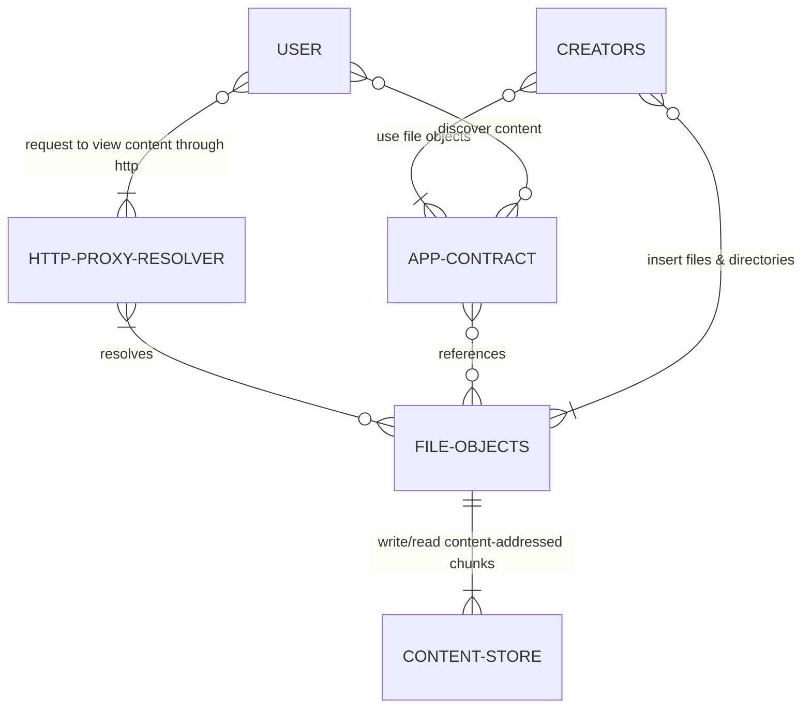

# Overview

ONCHFS is a permissionless unix-like content-addressable file system fully stored on-chain designed to be delivered through the http protocol, with cross-blockchain compatibility in mind.

## System components

## Core properties

### Permissionless

Anyone can write data, create files & directories, & reference files stored on the file system.

### On-chain

Every byte necessary to fully reconstruct the file system is stored on-chain. Standards provide a way to write & read the file system.

### Immutability

Content created on the file system can never be altered.

### Interoperability

The raw bytes of data are stored as chunks in a dumb Content Store contract, only supporting low level operations such as write & read. Because the chunks of data are Content-Addressed, many applications can use the Content Store for various purposes without impacting each other. This protocol provides extra abstraction layers to improve upon just having a Content Store.

### Content-Addressed

Chunks of data, files & directories are hashed and identified by their Content Store hash.

### Unix-like

An abstraction layer inspired by [inodes](https://en.wikipedia.org/wiki/Inode) on [Unix-like file systems](https://en.wikipedia.org/wiki/Unix_filesystem) provides a generic way to organise the Content Store into files & directories.

An inode can be a file or a directory:

- file: an ordered list of pointers to chunks of bytes in the stored in the Content Store, and some extra data describing the file
- directory: a list of inodes with their assigned names

inodes are also Content-Addressed, the hash of their content is used to identify the inodes on the file system. Such hashes are used as entry points to the file system, and are referred to as Content Identifiers (CID).

### Designed for the http protocol

As browsers are the main (if not the unique sensible) gateway to web3 assets, the protocol is designed to easily serve its content through the http protocol, in such a way that assets can easily reference and load other assets stored in the file system, using the native behaviour of modern browsers through the http protocol.

While the http protocol isn’t directly built into the Smart Contracts (yet), the protocol specifies particular guidelines so that consumers of the system provide particular metadata for delivering resources through the http protocol, in an optimised fashion.

However the protocol specifies how proxy servers should be implemented to navigate the file system using the URIs native to the file system.

### Extensible

As the protocol provides very low level primitives, it’s easy to extend it by providing other abstraction layers for navigating the file system.

For instance, we could imagine an “http-like” contract which would take “http-like” requests to return content stored in the file system with http-compliant response messages.
